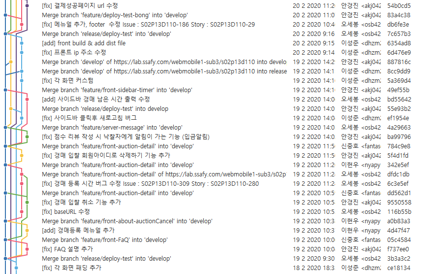

# 재능 역경매 서비스

**사용자들이 가지고있는 재능을 경매 시스템을 통해 거래하는 서비스** 

이 프로젝트는 전체 코드 공개가 불가능하여 일부 코드만  공개합니다.  
  
< 공개 범위 >  
서버 코드만 공개  

- commit log


## Overview

- node.js
- vue.js
- spring boot (maven)
- docker


## Prerequisites

Make sure you have installed all of the following prerequisites on your development machine:
 - Git - [Download & Install Git](https://git-scm.com/downloads). OSX and Linux machines typically have this already installed.
 - Node.js - [Download & Install Node.js](https://nodejs.org/en/download/) and the npm package manager. If you encounter any problems, you can also use this [GitLab Issue](https://lab.ssafy.com/webmobile1-sub1/s02p11d152/issues) to install Node.js.
 - Spring boot - [Spring boot](https://start.spring.io/) create new project


 ## Setup & Build

프로젝트를 로컬 스토리지에 저장
```bash
$ git clone https://lab.ssafy.com/webmobile1-sub3/s02p13d110.git
```

### Vue

기본적인 패키지들을 설치

``` bash
$ cd s02p13d110/front/somebodyhelpme
$ npm install 
```

프로젝트를 빌드
```bash
$ npm run build
```

### Spring boot

프로젝트 webapp 디렉토리 아래에 dist 하위 Files을 붙어넣는다.
`Spring boot project`를 `build`한다.


## Run

### Vue

로컬에서 프로젝트 실행

```bash
$ cd s02p13d110/front/somebodyhelpme
$ npm run serve
```

### Spring boot 

스프링 부트 프로젝트 

```bash
$ Run s02p13d110\back\Somebody\src\main\java\com\ssafy\somebody\SomebodyApplication.java
```


## Depoly

### Docker

[Docker 설치](https://hub.docker.com/?overlay=onboarding)

Docker DB Container 생성
```bash
$ docker run -d -p 9999:3306 -e MYSQL_ROOT_PASSWORD=input_password --name mariadb mariadb:10.3
```


### Google 이메일 설정

```bash
# application.properties
spring.mail.username=INPUT_EMAIL@gmail.com
spring.mail.password=INPUT_PASSWORD

```


